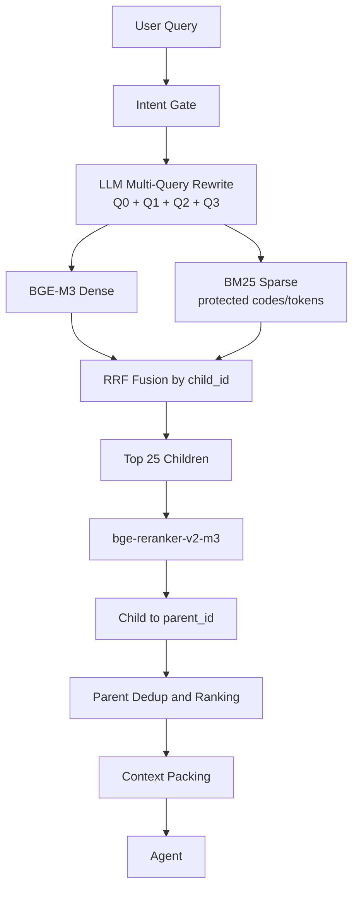

# EchoMind Parent–Child Hybrid RAG v2

## Why Parent–Child

Markdown H2 sections are the default Parent business units. Very long H2 sections split at H3 and then paragraph groups; unrelated H2 sections are never merged merely because one is short. Each Parent is recursively split into 400-character Children with 60-character overlap, preferring paragraph and sentence boundaries.

Children provide local retrieval precision. Parents provide the complete business rule to the generator. In one sentence: **small chunks find; larger sections answer.**

## Stable corpus

`doc_id`, `parent_id`, and `child_id` are derived from business identifiers and heading slugs, never absolute Windows paths or object hashes. `parents.jsonl` is the Parent Store, while `children.jsonl` is the shared corpus for both BGE dense and BM25 retrieval. The dense index is explicitly written with `embeddings=` and queried with `query_embeddings=`; Chroma's default embedding path is not used.

## Why Hybrid

Dense retrieval is useful for semantic paraphrases. BM25 is useful for exact error codes, order IDs, request IDs, and product-specific terms. RRF combines ranks without assuming the two raw score scales are comparable. The benchmark and ablation runner compare Dense, BM25, Hybrid, Rewrite+Hybrid, and the production reranker path on the same frozen 60 cases.

## Query rewrite and reranking

The original query is always retained. Rewrite cleaning removes empty, duplicate, invalid, and mechanical outputs, and falls back to the original query on an LLM failure. Cross-Encoder reranking uses `(original_query, child_content)` and is lazy-loaded. If loading, inference, or memory fails, the pipeline keeps RRF order and records `reranker_failed_rrf_order`.

## Context and safety

Only Parent source, section, and content are sent to the Agent. RRF ranks, matched queries, and reranker scores are debug evidence exposed by `/rag/debug`; they are not inserted into the generation context. The context instructs the Agent not to invent policy, timing, fees, permissions, or business rules when the retrieved knowledge is insufficient.

## Lifecycle and fallbacks

Startup loads an existing manifest/index only. A missing or source/config-mismatched index is reported as `index_missing`; it is not rebuilt implicitly. If the configured Docker Chroma hostname is unavailable on Windows, startup records `chroma_endpoint_unavailable_local_fallback` and opens the local persistent v2 collection. Dense failure falls back to BM25, BM25 failure falls back to Dense, reranker failure falls back to RRF, and all-retriever failure returns no fabricated knowledge. `/knowledge/rebuild` is the explicit rebuild boundary.
